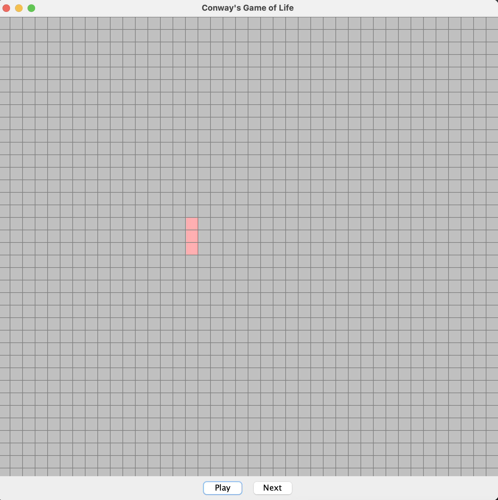

# Conway's Game of Life
This project implements Conway's Game of Life in Java, allowing users to observe how cellular patterns evolve over time based on simple rules. A play button enables manual progression through each generation on a customizable grid.

